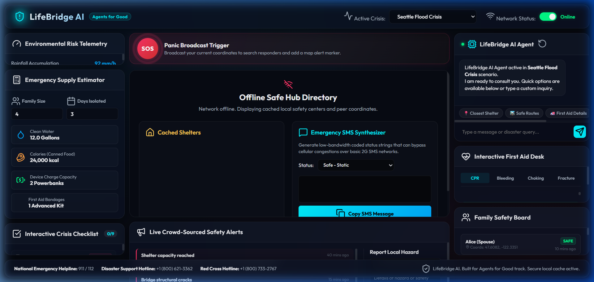
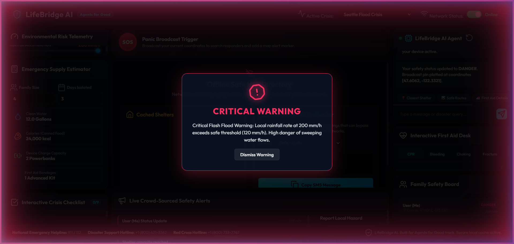
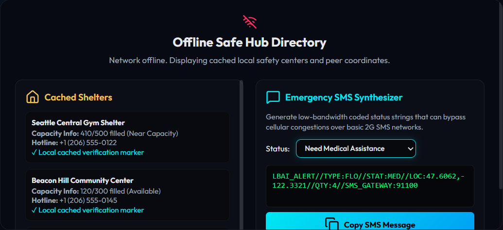
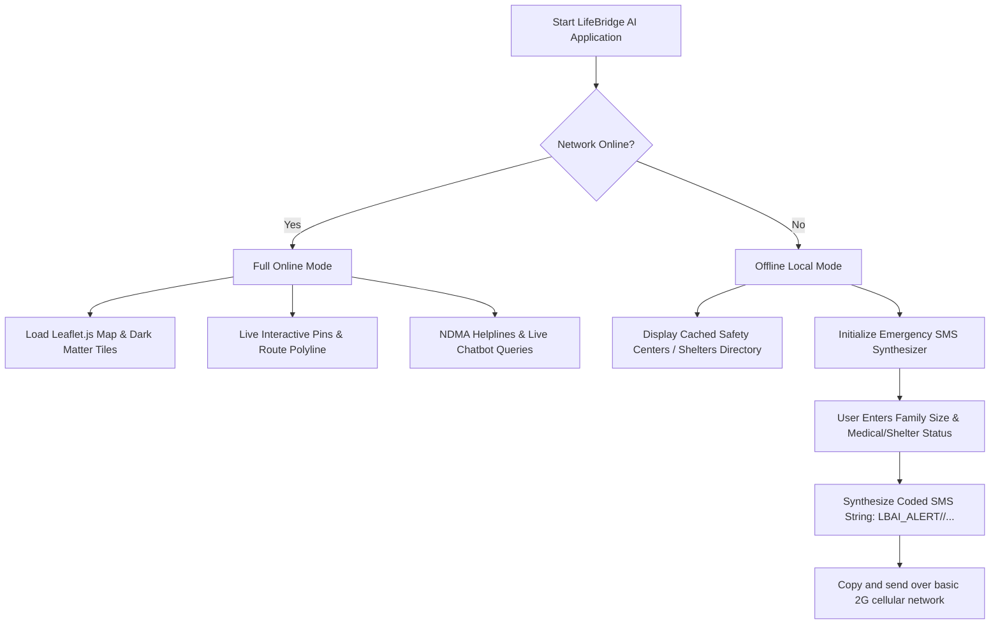
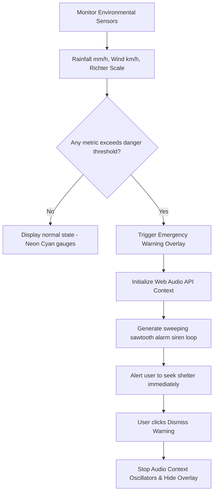
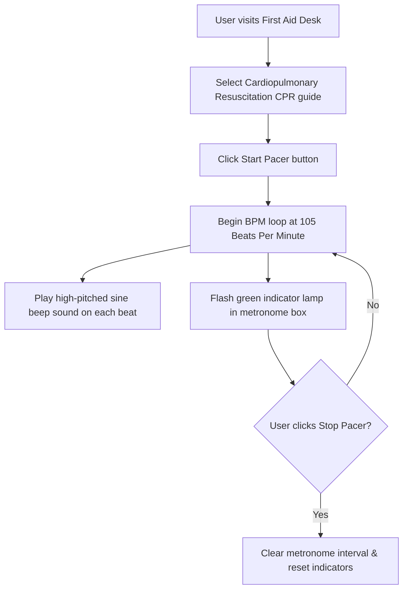

# LifeBridge AI 🌐🚨
> **Emergency & Disaster Assistant for Indian Crisis Scenarios**  
> *A resilient, low-bandwidth, AI-assisted dashboard designed to aid citizens and search-and-rescue teams during critical disasters.*

---

## 📸 Application Screenshots

### 1. Main Dashboard (Online Mode)
Features the real-time Leaflet map, environmental risk telemetry, community hazard reports, family safety boards, first-aid desk, and the LifeBridge AI chatbot.


### 2. Critical Warning Overlay (Telemetry Alerts)
Triggered dynamically when environmental sensor metrics cross safe operating levels (e.g., rainfall rate > 120 mm/h, wind speed > 180 km/h, seismic shock > 5.5 Richter). Uses the HTML5 AudioContext to sound a loud, synthesized emergency siren.


### 3. Offline Mode & SMS Coordinator
When network connectivity goes down, the app shifts into a resilient local-cache view containing offline shelters and a low-bandwidth **Emergency SMS Synthesizer** to transmit status codes over basic 2G/cellular networks.


---

## 🔄 Resilient Workflows

Here is how LifeBridge AI operates to guarantee safety and resource coordination under varying network conditions and environmental threats:

### 1. System Connectivity & Resiliency Flow


### 2. Environmental Telemetry & Siren Alarm System


### 3. CPR Compression Pacing Metronome


---

## ⚡ Core Features

- **📍 Interactive Leaflet Maps (CartoDB Dark Tiles)**: Visualizes coordinates of active shelters (color-coded by remaining bed capacities), active road blockages or chemical spills, and neon-green blinking safe evacuation corridors.
- **🌡️ Risk Telemetry Sensors**: Dynamic sliders to simulate Rainfall, Wind, and Seismic shifts. Automatically triggers alarms and siren noises if values exceed safe limits.
- **✉️ SMS Status Synthesizer**: Resilient low-bandwidth communication protocol. Encodes user's status (`OK`, `MED` for medical help, `SHEL` for shelter needed, `TRAP` for trap hazard) and location coordinates into a 2G SMS compatible string to copy-paste.
- **🔊 CPR Metronome (105 BPM)**: An audio-visual pacing metronome producing high-pitch sound frequencies and visual pulses to assist users in maintaining a steady 100-120 compressions/minute rate during emergency CPR procedures.
- **🤖 LifeBridge AI Agent**: A lightweight keyword-matching chatbot that analyzes disaster-related queries and provides instant access to shelter guides, utility shutdown protocols, and first-aid help.
- **📝 Interactive Disaster Checklist**: Populates standard disaster preparation checklists matching the active crisis type (Monsoon Floods, Earthquake, Cyclone, Road Accident) to help users pack efficiently.
- **👥 Family Safety board**: Allows users to check in on their family members' locations, update their own status, and place an automatic custom locator pin on the map.
- **📣 Crowd Alert reporting**: Allows citizens to submit custom warnings (road blocks, power failures) with description and severity, instantly adding them to the map and community feed.

---

## 🛠️ Tech Stack

- **Frontend Structure**: HTML5 (semantic elements)
- **Styling system**: Vanilla CSS (glassmorphism cards, custom sliders, blinking animations, red warning pulses, responsive grid layout)
- **Script Logic**: Vanilla JavaScript (Leaflet.js map layer rendering, HTML5 Web Audio API frequency generators, dynamic status encoders)
- **Icons**: Lucide Icons CDN

---

## 🚀 Local Run Guide

1. Clone this repository:
   ```bash
   git clone https://github.com/f4rhan16/LIFEBRIDGE-AI.git
   cd LIFEBRIDGE-AI
   ```

2. Run a local server to avoid CORS blockages on scripts or files:
   - Using Python:
     ```bash
     python -m http.server 8000
     ```
   - Using Node.js `http-server`:
     ```bash
     npx http-server -p 8000
     ```

3. Open your browser and navigate to:
   ```
   http://localhost:8000
   ```

---

## 📂 Code Repository Structure

- `index.html` - The main dashboard container incorporating telemetry, chat components, metronome wrappers, and layout sections.
- `styles.css` - Custom styling theme, glassmorphic panel layouts, gauges, alarm overlays, and animation routines.
- `data.js` - Data registers for Indian crisis templates (Mumbai, Uttarakhand, Odisha, Delhi), guides database, and chatbot reply banks.
- `app.js` - Interactive controllers for Leaflet maps, metronome sound generators, scenario switches, and coordinate syncing.
- `images/` - Standard screenshots showing main features and layouts.
